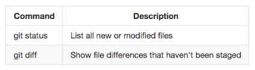

# Инструкция по работе с git репозиторием !!!
## Для начала работы вводим команду:
> git init

Если имя пользователя и почта еще не были заданы, то вводим следующие команды:

    1. git config --global user.name

    2. git config --global email

## Работа с файлами:
Для того, что бы добавить файл, нужно ввести следующие команды:

    1. git add file_name добавляем файл с именем file_name для отслеживания

    2. git commit -m "some massage" добавляем текущие изменения в репозиторий и подписываем их с помощью тега -m

    3. -a при добавлении этого тега пред тегом -m в команде git commit -m таким образм git commit -a -m "some massage"

Что бы отслеживать состояния репозитория нам помогут следующие команды:

    1. git status
    2. git log
    Чтобы показать ветки:
    git log --graph
    3. git diff

## Работа с коммитами: 
для того чтобы перейти к определенному коммиту необходимо использовать команду
git checkout code_commit
    
    code_commit - код коммита к которому мы хотим перейти, его можно посмотеть по команде git log

Что бы вернуться к последнему состоянию вводим команду:

    git checkout master

 Что бы просмотреть список команд вводим команду:

    git --help git эта команда выводит список всех доступных команд в git

    git --help commit эта команда выводит описание определенной команды введенной после тега --help, например в данном случае commit

## Ветки в git
Что бы увидеть все имеющиеся ветки, необходимо воспользоваться командой:
> git branch

Для создания новой ветки с именем branch_name , необходимо воспользоваться командой: 
> git branch branch_name

Для перемещения к ветке branch_name необходимо воспользоваться командой: 
> git checkout branch_name

## Слияние веток и решение конфликтов
Что бы слить информации и ветки в текущуюю:
> git megge branch_name 

В случае возникновения конфликта нужно удалить все лишние строки и оставить ту часть, которая нам нужна. Если необходимо, то можно отредактировать её.

 ## Удаление веток
Для того чтобы удалить ветку с именем brunch_name:
> git brunch -d brunch_name

Что бы удалить ветку, игнорируя ошибки:
> git brunch -D brunch_name

## Справка
Чтобы вызвать справку по команде, допишите тег:
> --help

## Пример

> git branch --help

> git add --help

> git commit --help

## Таблицы
Что бы создать таблицу воспользуемся символом | для разделения столбцов и символами :,-- для изменения расположения информации внутри столбцов, например так:
|Command|Description|
|:-----|:----------|
|git status| List all new or modified files|
|git diff| Show file differences that haven't been staget|

## Картинки 

## Информация о работе с удаленными репозиториями

## Про pull request
1. Делаем форк (fork) интересующего нас репо.
2. Делаем git clone нашей версии этого репо.
3. Создаем ветку с предлогаемыми изменениями.
4. Производим изменения тоько в этой ветке.
5. Отправляем эти изменения на свой (push)
6. В окне на GitHub появляется возможность отправить pull request!

